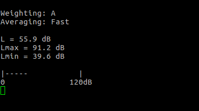

# SPL meter

Sound pressure meter running on STM32L476-DISCOVERY board

## Features:

- A, C and Z frequency weighting according to IEC 61672-1:2013
- Fast and Slow time weightings according to IEC 61672-1:2013
- Frequency range: 20Hz - 20kHz
- SPL range: 33 - 120dB
- MAX/MIN display

## Overview

Meter uses digital microphone as a sound pressure sensor. Microphone streams PDM data from its internal Sigma-Delta ADC, then PDM data is captured by STM32's DFSDM peripheral and converted to PCM stream. Next, raw microphone data is processed digitaly and SPL value (in dB unit) is obtained. Finally SPL value is displayed on LCD (available also through ST-Link/J-Link virtual COM port). Joystick is used to control the meter.
